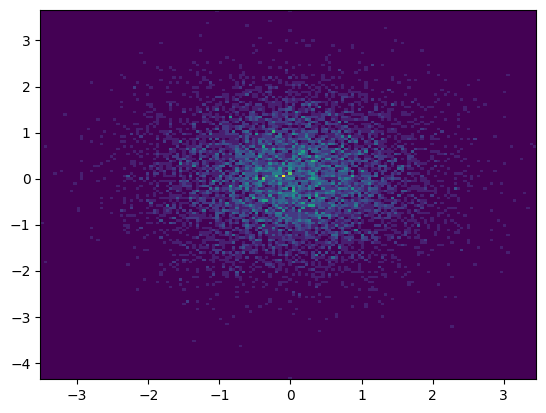
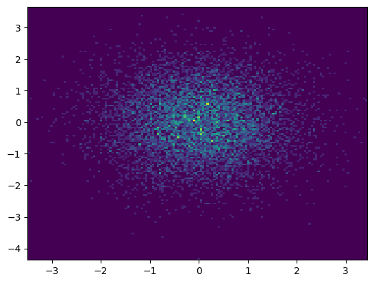
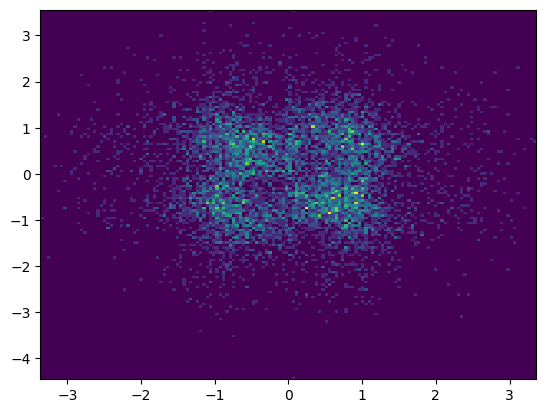
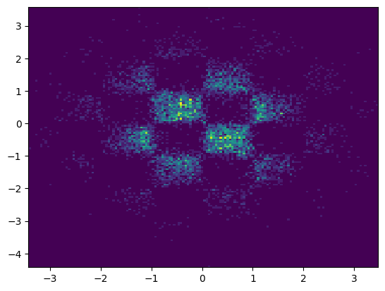
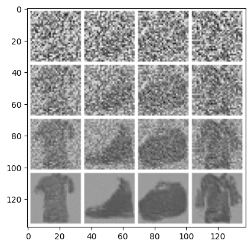

# Tiny Flow Models

Two unconditioned, flow-matching generative models for Gaussian CondOT probability paths, written in PyTorch and trained locally.

- `distribution.ipynb` implements a training procedure to estimate the probability path to match a zero mean, identity variance Gaussian to a Chess Board pattern distribution in $R^2$. The model architecture is a standard MLP, though notably Fourier Embeddings were used for the model inputs to assist it in learning the repeating Chess Board pattern. Model size: ~9 million parameters.

    
    
    
    

- `fashion.ipynb` implements a training procedure for generating images based on the FashionMNIST dataset, from Gaussian noise images. The model architecture is a simplified UNet, with residual connections between the encoder and decoder blocks. Model size: ~21 million parameters.

    

